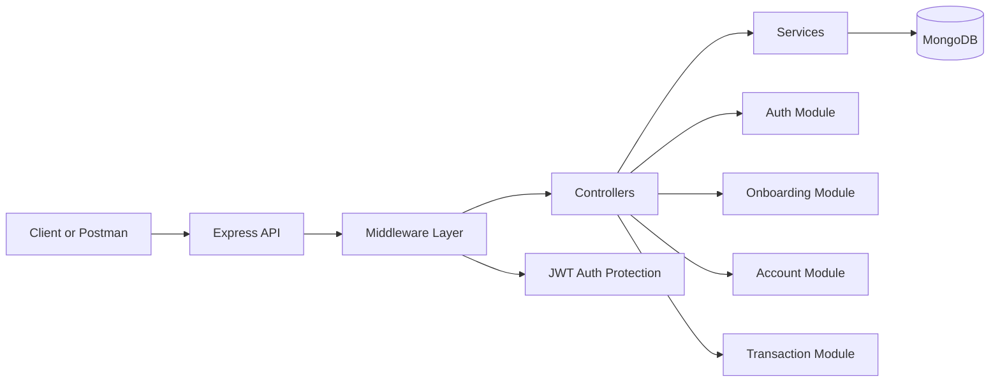

# Digital Market Banking API

Digital Market Banking is a backend banking simulation built with Node.js, Express, and MongoDB. It models a modern fintech-style API with authentication, customer onboarding, account creation, balance lookup, name enquiry, and transfer processing.

This project is especially useful in a recruitment setting because it demonstrates:

- Modular backend architecture
- JWT-based authentication with refresh-token rotation
- MongoDB data modeling with Mongoose
- Protected account and transaction workflows
- Transaction-safe balance movement using Mongoose sessions
- Clear separation of routes, controllers, services, models, and utilities

## Why This Project Stands Out

Instead of being a single CRUD endpoint, this codebase shows a realistic banking flow:

1. A user registers and logs in.
2. The user completes onboarding with BVN or NIN verification.
3. The platform creates a bank account with an opening balance.
4. The user can check account details, run name enquiry, and transfer funds.
5. Each transfer is recorded with a unique reference and transaction status.


## Tech Stack

- Node.js
- Express 5
- MongoDB
- Mongoose
- JWT
- bcryptjs
- Nodemon
- Helmet, CORS, Morgan, Cookie Parser

## Clone The Project

```bash
git clone https://github.com/Big-Vibes/Digital-Market-Banking.git
cd Digital-Market-Banking
```

## Install Dependencies

```bash
npm install
```

## Environment Variables

Create a `.env` file in the project root and add:

```env
PORT=4000
MONGO_URI=mongodb://127.0.0.1:27017/digital-market-banking
JWT_ACCESS_SECRET=your_access_secret
JWT_REFRESH_SECRET=your_refresh_secret
ACCESS_TOKEN_EXPIRES=15m
REFRESH_TOKEN_EXPIRES=7d
BANK_NAME=TS Academy Bank
DEFAULT_OPENING_BALANCE=15000
```

## How To Run

### Development

```bash
npm run dev
```

### Production-style start

```bash
npm start
```

Once the server starts, the API runs at:

```text
http://localhost:4000
```

If you change `PORT` in `.env`, the server will use that value instead.

## Port Configuration

| Service | Default Port | Notes |
| --- | --- | --- |
| Express API | `4000` | Controlled by `PORT` in `.env` |
| MongoDB | `27017` | Only if running MongoDB locally |

## System Design



### Backend Flow

- `Routes` expose the HTTP endpoints.
- `Controllers` handle request and response formatting.
- `Services` contain business logic such as registration, onboarding, account creation, and transfers.
- `Models` define MongoDB collections for users, accounts, verifications, transactions, and refresh tokens.
- `Middleware` protects private endpoints using bearer-token authentication.
- `Utils` generate account numbers, references, and JWTs.

## Core Modules

### 1. Authentication

Handles:

- User registration
- User login
- Access token generation
- Refresh token rotation
- Logout by refresh token removal

Base route:

```text
/api/auth
```

Endpoints:

- `POST /register`
- `POST /login`
- `POST /refresh`
- `POST /logout`

### 2. Onboarding

Handles identity onboarding through BVN or NIN verification.

Base route:

```text
/api/onboarding
```

Endpoints:

- `POST /verify-bvn`
- `POST /verify-nin`

Current implementation note:
The verification step is currently mocked with a simple validation rule for development purposes. Successful verification also creates the user's bank account.

### 3. Account

Handles:

- Fetching the logged-in user's account
- Getting current balance
- Running account name enquiry

Base route:

```text
/api/accounts
```

Endpoints:

- `GET /me`
- `GET /balance`
- `GET /name-enquiry/:accountNumber`

### 4. Transactions

Handles:

- Funds transfer
- Transaction history lookup
- Transaction status lookup by reference

Base route:

```text
/api/transactions
```

Endpoints:

- `POST /transfer`
- `GET /history`
- `GET /status/:reference`

This module uses Mongoose transactions so sender and receiver balance updates are handled safely during intra-bank transfers.

## Authentication Format

Protected endpoints expect a bearer token:

```http
Authorization: Bearer <access_token>
```

## Project Structure

```text
src/
  app.js
  server.js
  config/
    database.js
    env.js
  controllers/
  middleware/
  models/
  routes/
  services/
  utils/
```

## Data Model Overview

- `User`: profile, email, password, onboarding state
- `Account`: account number, account name, balance, bank name, status, currency
- `Verification`: BVN or NIN verification record
- `Transaction`: sender, receiver, amount, narration, reference, status, transfer type
- `RefreshToken`: stored refresh tokens and expiry metadata

## Example Startup Checklist

1. Clone the repository.
2. Install dependencies with `npm install`.
3. Add a valid `.env` file.
4. Make sure MongoDB is running locally or provide an Atlas connection string.
5. Start the API with `npm run dev`.
6. Test routes with Postman or any API client.

## Recruitment Summary

This codebase demonstrates practical backend engineering skills relevant to junior-to-mid backend roles:

- API design
- Authentication and session strategy
- Service-layer architecture
- Database modeling
- Transaction processing logic
- Security middleware integration

It is a strong foundation for extending into a full digital banking platform with notifications, admin tools, audit logs, external payment integrations, and automated testing.
